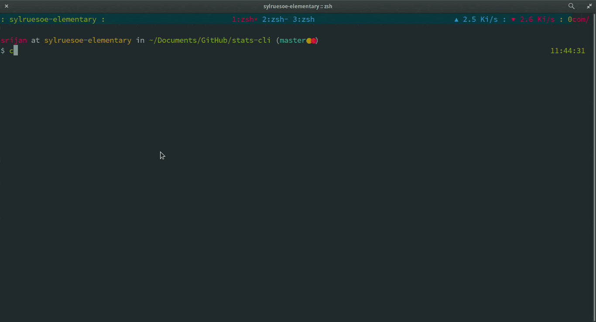

```
         __        __
   _____/ /_____ _/ /______
  / ___/ __/ __ `/ __/ ___/
 (__  ) /_/ /_/ / /_(__  )
/____/\__/\__,_/\__/____/
```

Compute min, max, average and standard deviation for a given list.

Install
-------

1. Copy stats to anywhere in \$path

Usage
------

```
USAGE: stats <filename>
```

Demo
----



License
-------

MIT © [Srijan R. Shetty](https://srijanshetty.in)
